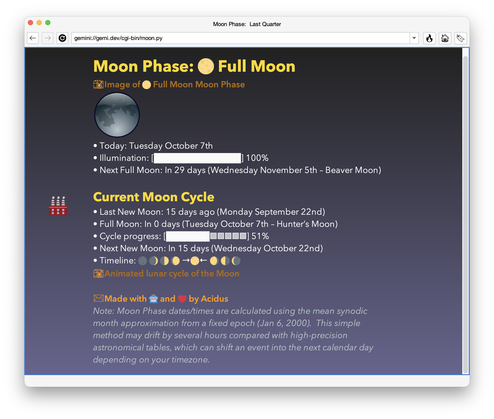
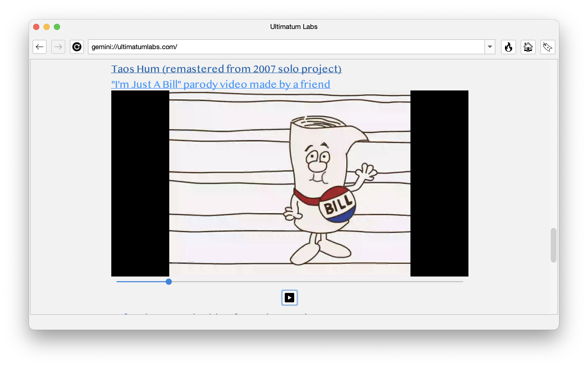
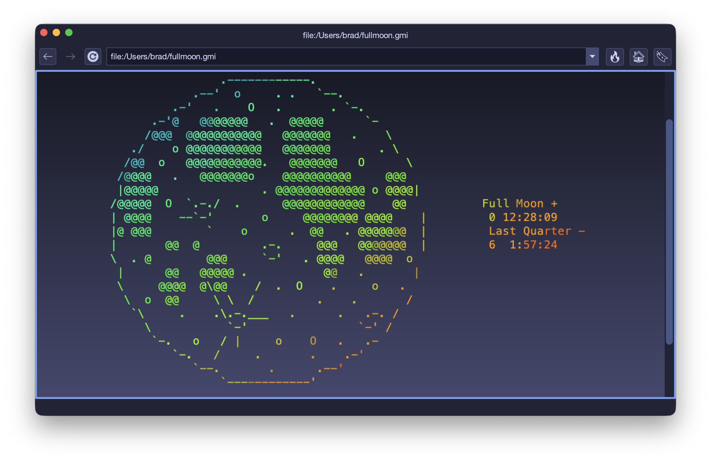

# Alhena 🌟

**Alhena** is an easy-to-use, multi-platform Gemini/Gopher/Spartan/Nex browser sporting an uncluttered, modern interface. Browse the small web in style!

[](https://metaloupe.com/alhena/alhena.html)

🔗 **[Official Website](https://metaloupe.com/alhena/alhena.html)**

## Features

- Modern UI with dozens of themes
- Color emojis with four emoji sets
- ZWJ (Zero Width Joiner) emojis
- ANSI colors for formatted text
- Inline audio and video (VLC required)
- Font chooser for proportional fonts
- Inline image viewer
- Smooth adaptive scrolling
- Asynchronous networking and file access
- Client certificate creation and management
- Trust On First Use (TOFU)
- Bookmarks and history
- Multiple windows and tabs
- Backup data with merge
- Secure remote sync
- Titan upload protocol with ;edit
- HTTP and Gopher proxy support
- Built-In HTTP to Gemtext converter
- Spartan protocol
- Nex protocol
- Gemtext-aware Titan text editor
- Optional favicon.txt support
- Printing (and therefore PDF with drivers)
- Embedded text and media from data URLs
- Custom page styles by domain, url and theme
- Address bar autocomplete from history
- SVG and animated GIF support
- Gradient backgrounds
- SOCKS5 proxy support
- Gopher protocol
- Inline streaming on all protocols (with VLC)
- External media players

## 🎨 Design

The goal is to provide a familiar, easy-to-use interface for exploring Geminispace. Gemtext documents are rendered without added clutter. Emojis are displayed in color and ZWJ emojis appear as a single image. 👨🏼‍🚀

Any system font can be used for displaying proportional text. Dozens of light and dark themes are available to make browsing easy on the eyes. The interface is simple and intuitive.

All settings, bookmarks, certificates and history are saved in an embedded database that can be backed-up and restored on other computers. Secure remote sync can be used to easily move your settings to other machines.

## 🚀 Getting Started

### **Building from Source**
Alhena is built using **Maven** on Java 21 or greater. To compile, simply run:

```sh
git clone https://github.com/mochaman/alhena.git
cd alhena
mvn package
```

The `alhena.jar` will be created and copied to `target/lib`. To run, call java -jar with the path to /lib/alhena.jar. For example (if already in the target directory): 

```sh
java -jar ./lib/alhena.jar
```
## 📽️ Inline Media With VLC

Alhena supports inline video and audio playback when VLC is installed. The feature must be enabled from the 'Settings' menu and the installed VLC architecture must match the OS (64-bit on a 64-bit OS). The vlcj library does a good job of detecting VLC but there may be instances where you need to specify the location. This is done by creating a vlcj.config file in the ~/.config/vlcj directory. Examples:

On MacOS, discovery works fine if building from source. If you use one of the pre-build .dmg installs, you will likely need to create the vlcj.config file with the following line (assuming VLC is installed in the default location):
```sh
nativeDirectory=/Applications/VLC.app/Contents/MacOS/lib
```
On versions of Linux using a snap install of VLC (like modern Ubuntu), you will likely need to create the vlcj.config file. The following is based on an Ubunutu snap install. If you have issues with a snap VLC install, try installing VLC via apt-get.
```sh
nativeDirectory=/snap/vlc/current/usr/lib
```
Whether the ~/.config/vlcj/vlcj.config file is required depends on whether discovery can find VLC. In testing, the embedded player worked "out of the box" on Windows, MacOS (built from source), Raspberry Pi and FreeBSD. VLC 3.x is required. Older versions will not work. VLC 4.x (in development) may or may not work.

Privacy Considerations: Per the author of vlcj, "it may be possible that a remote network access is made for meta data and album/cover art. This may unintentionally expose sensitive data regarding the media being parsed." If this is a concern, the embedded media player can be turned off from 'Settings'.

## 📥 Installs

Prebuilt binaries are available for Windows, Mac, Linux and FreeBSD. Java is NOT required (except for the Basic install). The platform specific installs each include a small, custom jvm created with jlink.

- [Windows x64](https://github.com/mochaman/alhena/releases/download/v5.4.8/alhena-5.4.8_windows_x64.zip) MSI installer
- [MacOS aarch64](https://github.com/mochaman/alhena/releases/download/v5.4.8/alhena-5.4.8_aarch64.dmg) DMG  (unsigned)
- [MacOS x64](https://github.com/mochaman/alhena/releases/download/v5.4.8/alhena-5.4.8_x64.dmg) DMG (unsigned)
- [Linux x64](https://github.com/mochaman/alhena/releases/download/v5.4.8/alhena-5.4.8_linux_x64.tgz) untar and run 'Alhena' script
- [Linux aarch64](https://github.com/mochaman/alhena/releases/download/v5.4.8/alhena-5.4.8_linux_aarch64.tgz) untar and run 'Alhena' script
- [FreeBSD x64](https://github.com/mochaman/alhena/releases/download/v5.4.8/alhena-5.4.8_freebsd_x64.tgz) untar and run script
- [Basic](https://github.com/mochaman/alhena/releases/download/v5.4.8/alhena-5.4.8_nojava.zip) JAVA_HOME must point to Java 21+ directory. Run via .bat or .sh scripts.

## ⚙️ GraalVM Native Image

An experimental version of Alhena compiled with GraalVM native-image is available for Linux glibc x64. Run via the alhena.sh script. Remote sync has been disabled and printing is untested. Feedback welcome. More information is available in the included readme.

- [Native Linux](https://github.com/mochaman/alhena/releases/download/v5.4.8/alhena-native-4.5.7_linux_glibc_x64.tar.gz) untar and run 'alhena.sh'

## 🐳 Docker

You can try Alhena in a browser or VNC client with Docker.

🔗 **[Alhena on Docker Hub](https://hub.docker.com/r/bgrier1/alhena)**

```
docker run -p 6080:6080 -it --rm alhena
```
Then open your favorite browser and enter the following url:
```
http://localhost:6080/vnc.html
```
The password is `alhena`

## 📷 Screenshots

Streaming Audio: 


Embedded Video (VLC Required):



ANSI Color:  



## 🛠 License
Alhena is licensed under the **GNU General Public License v3.0 (GPLv3)**. See [LICENSE](LICENSE) for details.

### License Change Notice:
As of version 5.0.5, Alhena is licensed under the GPLv3.  
Previous versions (<= 5.0.1) were licensed under the BSD 2-Clause License


---

Have suggestions or found a bug? Open an issue or contribute via pull requests! 🚀

